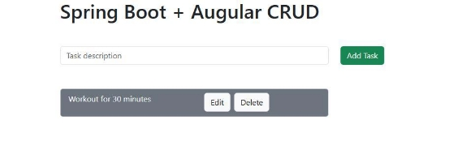
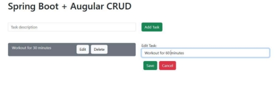
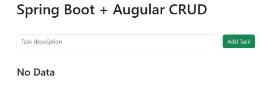

**PROJECT OVERVIEW**

**Project Overview:** To-Do List Application

**Project Title:** To-Do List Application

**Objective:**

This is an interactive to-do list application built using Spring Boot and Angular, designed to allow users to add, edit, and delete tasks easily. The frontend, developed in Angular with Bootstrap styling, provides a responsive user experience. The backend, implemented with Spring Boot and Java, manages task data stored in a MySQL database. Hibernate and JPA are used for seamless data interaction and persistence.

**Key Features:**

1. Task creation, editing, and deletion functionality.
1. Real-time updates for a dynamic user experience.
1. Responsive UI using Bootstrap.

**Technologies Used:**

- **Front-end**: Angular, Bootstrap, JavaScript, HTML, CSS
- **Back-end**: Spring Boot, Java
- **Database**: MySQL
- **ORM**: Hibernate, JPA
- **IDEs**: Visual Studio Code, Eclipse

**Project Images:**

Homepage

Adding Task

Editing Task

Deleting Task

**Conclusion:**

This to-do list application demonstrates a full-stack solution combining a modern frontend with Angular and a robust backend using Spring Boot. By leveraging Hibernate and JPA for data management, the application ensures efficient and reliable data persistence with MySQL. The project provides a practical foundation for CRUD operations in a web application, showcasing the use of industry-standard tools and frameworks. This experience highlights proficiency in building responsive, data-driven applications and reinforces essential skills in full-stack development. \*\*\*\*\*\*\*\*\*\*\*\*\*\*\*\*\*\*\*\*\*\*\*\*\*\*\*\*\*\*\*\*\*\*\*\*\*\*\*\*\*\*\*\*\*\*\*\*\*\*\*\*\*\*\*\*\*\*\*\*\*\*\*\*\*\*\*\*\*\*\*\*\*\*\*
